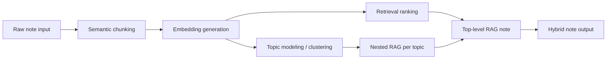

# MindIt Hybrid Notes Maker

MindIt is a hybrid note-making app that turns raw text into a structured, grounded note. Instead of treating the input as one big blob of text, it breaks the note into meaningful parts, measures how those parts relate to each other, groups the related pieces into topics, and then builds a final note from the strongest retrieved passages.

The result is a note that feels organized and explainable. You can see the chunks, the topic clusters, the retrieved sources, and the final grounded draft all in one place.

## What this project does

MindIt is built as a local client/server app:

- The server receives note text and runs the hybrid note pipeline.
- The client renders the results as a compact dashboard.
- The pipeline is deterministic and local. It does not depend on an external LLM call.

The app combines four ideas that are often used separately:

1. Semantic chunking
2. Embeddings
3. Topic modeling
4. RAG, or Retrieval-Augmented Generation

Used together, they create a hybrid notes maker that can split, relate, group, retrieve, and rewrite source text in a way that stays close to the original material.

## Core concepts

| Concept | What it means | Role in MindIt |
| --- | --- | --- |
| Semantic chunking | Splitting text into meaningful passages instead of arbitrary fixed-length blocks | Creates the units that the rest of the pipeline works with |
| Embeddings | Turning text into numeric vectors that capture similarity | Lets the app compare chunks and score related passages |
| Topic modeling | Grouping chunks that share similar ideas, keywords, or vector patterns | Organizes the note into topic clusters |
| RAG | Retrieving the most relevant source passages and using them to write a grounded draft | Produces the final note and the nested topic-level notes |

### Semantic chunking

Semantic chunking is the first step. The input note is split into smaller pieces that still make sense on their own. In MindIt, this usually means:

- Heading lines become their own section context.
- Bullet points stay together as individual ideas.
- Long paragraphs are broken into smaller sentence groups.

This matters because the rest of the system works better on focused passages than on one long, mixed document. A smaller chunk is easier to score, easier to cluster, and easier to retrieve later.

### Embeddings

Embeddings are vector representations of text. Two passages with similar meaning should end up with vectors that are close together.

In this project, the embeddings are generated locally with a lightweight hashed-IDF approach. That keeps the app fast and dependency-light while still giving the pipeline a meaningful similarity signal.

MindIt uses embeddings to answer questions like:

- Which chunks are most similar to the overall note?
- Which chunks belong together?
- Which passage should be treated as the best source for a draft?

### Topic modeling

Topic modeling is the step where related chunks are grouped together into clusters.

In many research systems, topic modeling can mean statistical methods such as LDA. In MindIt, the idea is simpler and more practical: use the similarity signals from the embeddings and the repeated keywords in the chunks to cluster related ideas together.

That gives you a topic map of the note. Each topic cluster becomes a smaller, focused region of the document, which can then receive its own nested retrieval pass.

### RAG

RAG stands for Retrieval-Augmented Generation.

The idea is:

1. Retrieve the most relevant source passages.
2. Use those passages as the basis for a grounded draft.

This prevents the note from becoming too generic or drifting away from the original input. Instead of inventing new content, the system prefers to rewrite from the strongest retrieved evidence.

In MindIt, RAG happens twice:

- A document-wide RAG pass builds the main hybrid note.
- Each topic cluster also gets a smaller nested RAG pass.

That is why the app is described as a hybrid notes maker and sometimes as RAG inside RAG.

## How the hybrid pipeline works

The pipeline is easiest to understand as a sequence:



### Step by step

1. The user pastes raw notes into the input box.
2. The backend splits the text into semantic chunks.
3. Each chunk gets a local embedding.
4. Similar chunks are grouped into topic clusters.
5. The app ranks the chunks by similarity and relevance.
6. The top passages become the grounding sources for the main RAG note.
7. Each topic cluster also gets its own local RAG summary, draft lines, and sources.
8. The frontend renders the whole result as a compact dashboard.

The important part is that these steps work together. Semantic chunking gives the system structure, embeddings give it relatedness, topic modeling gives it organization, and RAG turns the result into readable notes.

## Why the hybrid approach helps

A simple summary can miss detail. A pure keyword search can miss meaning. A large monolithic note can hide useful context.

The hybrid approach solves that by combining the strengths of each technique:

- Chunking keeps the source text manageable.
- Embeddings help the app understand which pieces are semantically close.
- Topic modeling groups related ideas so the note has a clear shape.
- RAG keeps the final output grounded in the original text.

That makes the output easier to trust because the source passages are visible and the final note is built from them.

## What the UI shows

The frontend is designed as a compact dashboard. It shows:

- Pipeline metrics for the full run
- Topic cluster cards
- Nested RAG summaries inside each topic
- The final hybrid RAG note
- Grounding sources used to support the draft
- Follow-up prompts that suggest what to refine next

This makes the app feel like a note intelligence workspace rather than a plain text summarizer.

## Project structure

```text
README.md
client/
	src/
		AppHybrid.jsx
		main.jsx
		index.css
	package.json
server/
	src/
		index.js
		noteIntelligence.js
		textProcessor.js
	package.json
```

- `server/src/index.js` exposes the API.
- `server/src/noteIntelligence.js` contains the hybrid note pipeline.
- `client/src/AppHybrid.jsx` renders the dashboard.
- `client/vite.config.js` proxies API requests to the local server.

## API

The main endpoint is:

```http
POST /api/process
```

Request body:

```json
{
	"text": "Your raw note text here"
}
```

The response includes structured data for the UI, including:

- `pipeline`
- `semantic`
- `topics`
- `embeddings`
- `rag`

There is also a lightweight health endpoint:

```http
GET /api/health
```

## Local setup

### Prerequisites

- Node.js 20 or newer is recommended.
- npm is used for both the client and server packages.

### Install and run the server

```bash
cd server
npm install
npm run dev
```

The server runs on port `4000` by default.

### Install and run the client

```bash
cd client
npm install
npm run dev
```

The Vite dev server proxies `/api` requests to the backend so the frontend can talk to the local processor without extra configuration.

## Implementation notes

- The note pipeline is local and deterministic.
- The embedding model is lightweight and hashed rather than using a remote embedding API.
- The topic modeling step is heuristic clustering, not a full academic LDA implementation.
- The final note is grounded in retrieved source passages so the output stays close to the input.
- No persistent storage is used for note content in the current app flow.

## If you are exploring the code

Start with these files:

- `server/src/index.js` for the API surface
- `server/src/noteIntelligence.js` for the hybrid processing logic
- `client/src/AppHybrid.jsx` for the rendered result layout

If you want to understand the app quickly, trace the flow from raw text input to chunking, then to embeddings, then to topic clusters, and finally to the nested RAG output.
=======
# MindIt!

